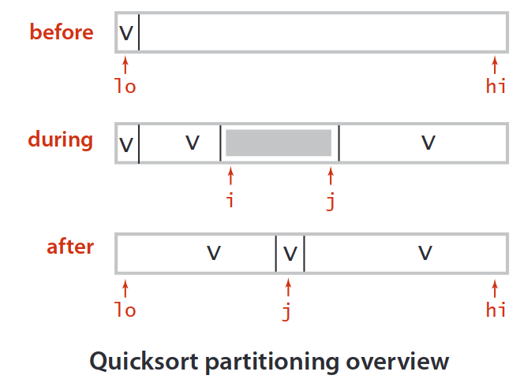

[TOC]
# Analyze algorithms

## reasons to analyze algorithms

- predict performance
- compare algorithms
- provide guarantees
- understand theoretical basic
- **avoid performance bugs** -- primary reason

## scientific methods applied to analysis of algorithms
- scientific method
  - observe some features of the natural world
  - hypothesize a model that is consistent with the observations
  - predict events using the hypothesis
  - verify the predictions by making further observations
  - validate by repeating until the hypothesis and observations agree
- principles
  - experiments must be reproducible
  - hypothesis must be falsifiable
- feature of the natural world
  - computer itself

## mathematical model
- cost model: use some basic operation as a proxy for running time
- tilde notation:
  - estimate running time (or memory) as a function of input size `N`
  - ignore lower order terms

## order of growth
- need linear of linearithmic algorithm to keep pace with Moore's law

## theory of algorithms
- best case: lower bound on cost
  - determined by "easiest" input
  - provide a goal for all inputs
- worst case: upper bound on cost
  - determined by "most difficult" input
  - provide a guarantee for all inputs
- average case: expected cost for random input
  - need a model for "random" input
  - provide a way to predict performance
- goals
  - **establish "difficulty" of a problem**
  - **develop "optimal" algorithms**
- approach
  - suppress details in Analysis
  - eliminate variability in input model by focusing on the worst case
- optimal algorithm
  - performance guarantee for any input
  - no algorithm can provide a better performance guarantee
- upper bound: a specific algorithm
- lower bound: proof that no algorithm can do better
- optimal algorithm: lower bound equals upper bound

# sort

## elementary sorts
### selection sort
at each turn, select the right element from rest, and put it in final position.
- proposition
  - compares: $\sum_{0}^{N-1}(N-i-1) = \frac{N(N-1)}{2} \sim \frac{N^2}{2} = \Theta (N^2)$
  - exchanges: $N = \Theta (N)$
- running time insensitive to input: quadratic time, even if input is sorted
- data movement is minimal: linear time of exchanges

### insertion sort
at each turn, select right element from "seen" elements, then move it from right to left, switching each "larger" element to its left
- proposition
  - best case: $N-1$ compares, $0$ exchanges
  - worst case: $\sim \frac{N^2}{2}$ compares, $\sim \frac{N^2}{2}$ exchanges
  - average case: with random input, assume that each item goes half way. $\sim \frac{N^2}{4}$ compares, $\sim \frac{N^2}{4}$ exchanges
- exchanges equal to inversions
- excellent for partially sorted arrays whose inversions is $O(N)$ -- in linear time, for compares = exchanges + $N - 1$
- fine to tiny arrays

### shell sort
shell sort is an extension of insertion sort. partially sorted array is friendly to insertion sort.

- `h-sorted` array: subarray that has strike h started anywhere is sorted

- `h-sort` procedure doesn't spoil `g-sorted` array

- Q: what kind of incremental sequence should we use?
 - powers of two: 1, 2, 4, ... -- not good
 - powers of two minus one: 1, 3, 7, ... -- maybe
 - $3x + 1$: 1, 4, 13, ... -- ok and easy to compute
 - `Sedgewick`: 1, 5, 18, 41, 109, 209: 
$$
 \forall i \geq 0, s[i] = \left \{ \begin{array}{rcl}
9 \times (4^j - 2^j) + 1 & where & j = \lfloor \frac{i}{2} \rfloor & and & i = 2k \\
4^j - 3 \times 2^j + 1 & where & j = 2 + \lfloor \frac{i}{2} \rfloor & and & i = 2k + 1 \\
 \end{array} \right. \\
$$

- proposition: 
  - worst case: $N ^ {\frac{3}{2}}$ (using $3x + 1$) compares

## merge sort
- basic plan
  - divide array into two halves 
  - recursively sort each other
  - merge two halves
- proposition
  - time: $\Theta(N \log{N})$
    - compares $C(N) \in [\frac{1}{2} N \log{N}, N \log{N}]$, also insensitive to input
    - access $A(N) = 6N \log{N}$, $2N$ for copy, $2N$ for move back, $2N$ for compares
  - auxiliary space: $\Theta(N)$
- merge sort is optimal with respect to compares but not to memory
- any compare-based algorithm has lower bound $\Theta(N \log{N} )$
- lower bound may not hold when knowing more information about initial order, distribution or representation of keys

## quick sort

- basic plan
  - shuffle the array (guarantee performance)
  - partition so that, for some j
    - entry `a[j]` is in place
    - no larger entry to the left of `a[j]`
    - no smaller entry to the right of `a[j]`
  - sort each piece recursively

- proposition
  - best case: compares $C_N \sim N \log{N}$
  - worst case: compares $C_N \sim \frac{1}{2}N^2$
  - average case:
    - for distinct keys, compares $C_n \sim 2N \log{N}$, exchanges $E_N \sim \frac{1}{3} N \log{N}$
  - in-place
  - not stable
- practical improvements
  - insertion sort small sub-arrays
  - median of sample (median of `arr[low]`, `arr[mid]` and `arr[high]`)
  - entropy-optimal sorting: sub-arrays of equal keys often occur. from linearithmic to linear (see below)
- three-way partion (much faster with large number of duplicate keys)

### select

- upper bound $\Theta (N)$ (theoretically proved, but not practical)
- repeat partitioning on a sub-array until $k_{th}$ element found

## heap sort

### priority queue

- heap sort is optimal with memory and time
- proposition
  - heap construction uses $\leq 2N$ compares
  - heap sort uses $\leq 2N \log{N}$ compares and exchanges
- bottom line
  - inner loop longer quick sort
  - makes poor use of memory
  - not stable

## radix sort

## summary

# search

## binary search trees (balanced)

### 2-3 search tree
- by maintaining two-nodes and three-nodes, each path from root to null link has same length
- proposition
  - height
    - worst: all 2-nodes $\log_2 N$
    - best: all 3-nodes $\log_3 N$
  - guaranteed logarithmic performance for search and insert
- cumbersome to implement

### red-black BST
- left-leaning red-black BSTs
- use "internal" left-leaning links as glue for 3-nodes
  - red links "glue" nodes within a 3-node
  - black links connect 2-nodes and 3-nodes
  - $s.t.$
    - no node has two red links connected to it
    - every path from root to null link has the same number of black links (perfect black balance)
    - red links lean left

### b-tree

[TBD]

## hash tables

1. mapping
2. collision-resolution: separate chaining and line probing

### mapping -- hashing function

- requirements

  1. efficient to compute

  2. consistent -- instance equality -> hash-code equality

  3. uniformly distribute the keys

- different types should have different hash functions

- positive integers: modular hashing $k \% M$
  - however, values not disperse evenly
  - $M$ is often prime
- floating-point numbers: modular hashing function on binary representations of them
- string: treat as N-digit base-R integer `hash = ((R * hash) + s[i]) % M`
  - if computing hash-code is prohibitive, software caching it
- compound keys: `hash = (((day * R + month) % M) * R + year) % M`, if `R` is small, cost of modular by `M` can be eliminated

### collision-resolution

- separate chaining -- buckets + lists
- linear probing -- only buckets,  `resize` is necessary

# graph

## glossary

- when there is an edge connecting two vertices, the vertices are **adjacent** to one another and the edges is **incident** to them
- the **degree** of a vertex is the number of edges incident to it
- a **subgraph** is a subset of graph's edges and associated vertices that constitutes a graph
- a **path** is a sequence of vertices connecting by edges
  - a **simple path** is one with no vertices
  - a **cycle** is one that starts and ends with the same vertex
  - a **simple cycle** is a cycle that has no repeated vertices
  - the **length** of a cycle or a path is its number of edges
- a graph is **connected** if there is a path from everty vertex from everty vertex
  - a graph that is not connected consists a set of connected components, which are **maximal of connected subgraphs**
- a **acyclic** graph is a graph with no cycles
  - a **tree** is an acyclic connected graph. equal conditions:
    - `V - 1` edges and no cycles
    - `V - 1` edges and connected
    - connected but remove any edge disconnects it
    - acyclic but add any edge creates a cycle
  - a **forest** is a disjoint set of trees
  - a **spanning tree** of a connected graph is a tree (connected and asyclic) that contains all vertices of that graph
- **density**: if number of edges is within a small constant factor of `V`, **sparse**; otherwise, **dense**
- **bipartite** graph
- vertices v and w are **strongly connected** if there is both a directed path from v to w and a directed path from w to v
  - a strong component is a maximal subset of **strongly-connected** vertices
- a **cut** in a graph is a partition of its vertices into two  (nonempty) sets
- a **crossing edge** connects a vertex in one set with a vertex in the other

order-of-growth performance for typical `Graph` implementations

## undirected graph

- DFS: time proportional to $V + E$
- BFS: time proportional to $V + E$ in the worst case; if connected, $\sum_{i=1}^{n} d_i = 2E$

| Problem                      | Solution                     |
| ---------------------------- | ---------------------------- |
| single-source connetivity    | DFS                          |
| single-source paths          | DepthFirstPaths              |
| single-source shortest paths | BFS                          |
| connectivity                 | ConnectedComponets/UnionFind |
| cycle detection              | Cycle                        |
| bipartiteness                | TwoColor                     |

## directed graph

| Problem                           | Solution                    |
| --------------------------------- | --------------------------- |
| path (single-source reachability) | DFS                         |
| shortest path                     | BFS                         |
| topological sort                  | DFS and reverse postorder   |
| strong connectivity               | Kosaraju-Sharir (DFS twice) |
| transitive closure                |                             |
| page rank                         |                             |

### cycle detection

- recursive call stack represents a path
- DFS method
  - if we find a edge v -> w which is already on the stack, we find a cycle

### topological sort

- precedence scheduling -- put the vertices in order such that all its directed edges point from a vertex earlier in the order to a vertex later order
- proposition: DAG -- a digraph has a topological order if no directed cycle
  - detecting backward edge while DFS to detect possible cycles

- reverse postorder of DFS (reversed order of vertices inserted immediately after DFS finished) in a DAG is a topological sort
  - in time proportional to $V + E$
  - any edge v -> w, when `dfs(v)` is called
    - `dfs(w)` is called and returned
    - `dfs(w)` is not called
    - `dfs(w)` is called but not returned (impossible)
    - such that w is added to the stack before v is added

### strong connected components

- strong connected: mutually reachable
- Kosaraju-Sharir algorithm
  - reverse graph. strong components in $G$ are the same as in $G^R$
  - kernel DAG. contract each strong components into a single vertex
  - idea
    - compute topological order (reverse postorder) in kernel DAG
    - run DFS, considering vertices in reverse topological order
  - the second pass of DFS traverse the graph in topological order of $G^R$, and when calling `dfs(v)`, all vertices met are in the same strongly connected components (no edge towards other strongly connect)
  - time proportional to $E + V$

## minimum spanning tree

- find a min weight spanning tree
- simplifying assumptions
  - edge weights are unique
  - graph is connected
  - -> MST is unique
  - what if edge weights are not distinct? -- greedy algorithms still work
  - what if graph is not connected? -- minimum spanning forests
- cut properties
  - a **cut** in a graph is a partition of its vertices into two  (nonempty) sets
  - a **crossing edge** connects a vertex in one set with a vertex in the other
  - -> given any cut, the crossing edge of min weight is in the MST
  - we can prove but assume the contradictory
- greedy algorithm
  - start with all gray edges
  - find cut with no black crossing edge, color its min weight to black
  - run until $V-1$ edges colored to black
  - implementations: -- choose cut and find min weight edge

### Kruskal algorithm

- considering edges in ascending order
- add edges to tree unless that will create a circle
- use union-find to test connectivity ($\log{V}$)
- proportional to $E \log{E}$ in the worst case

### Prim algorithm

- start with vertex 0 and greedily grow tree T
- add to T the min weight edge  with exactly one endpoint in T
- repeat until $V - 1$ edges
- how to find min weight edge to add?
  - lazy version: use PQ to maintain the edges
    - proportion:
      - time: $E \log{E}$
      - extra space: $E$
  - eager version: maintain a PQ of vertices connected by an edge to T where the priority of a vertex is the weight of the shortest edge connecting it to the tree
    - delete min priority vertex v from PQ and add the edge to the tree
    - update PQ by considering all the edges v-w incident to v
      - if w is already in the tree, ignore
      - if w is not on the PQ, add it to the PQ
      - decrease its priority if v-w becomes the shortest edge

## shortest path

- variants

  - source sink: from one vertex to another
  - single source: from one vertex to every other
  - all pairs: between all pairs of vertices

- restrictions on edges

  - nonnegative weights
  - arbitrary weights
  - euclidean weights

- cycles?

  - no directed cycles
  - no negative cycles

- simplifying assumptions: shortest paths from v to each other vertices exist

- how to choose which edge to relax?

  - Dijkstra's (nonnegative weights)
  - Topological sort (no directed cycles)
  - Bellman-Ford's (no negative cycl)

### nonnegative weights -- Dijkstra algorithm

- consider vertices in increasing order of distance to s
- add vertex to the tree and relax all the edges pointing to the vertex

### acyclic shortest path -- topological sort

- consider vertices in topological order
- add vertex to the tree and relax all the edges pointing to the vertex

### parallel job scheduling -- critical path

### negative weights -- Bellman-Ford algorithm

- negative cycles -- a cycle whose sum of weights is negative
- proportion
  - a SPT (shortest path tree) exists if there is no negative cycles
- set distance of s to 0 and others to $\infin$
- repeat for V times: relax all E edges
- time proportional to $O(V^2 + VE)$

- in acyclic digraph -- linear time
  - topological sort first
  - relax edges in topological order
  - time proportional to $\Theta(V + E)$

### summary

## maximum flow and minimum cut

### $\textbf{mincut}$ problem

- given a digraph with positive edge capacity, source $s$ and destination $t$
- a $\textit{st}\text{-cut (cut)}$ is a partition of the vertices into two disjoint sets, with $s$ in one set $A$ and $t$ in other set $B$
- its $\text{capacity}$ is the sum of capacities from $A$ to $B$
- 
- $\text{mincut}$ problem -- find a cut of minimum capacity

### $\textbf{maxflow}$ problem

- the same input as $\text{mincut}$'s
- a $\textit{st}\text{-flow (flow)}$ is an assignment of values to edges that:
  - capacity constraint: $0 \le \text{edge's flow} \le \text{edge's capacity}$ 
  - local equilibrium: $\text{inflow} = \text{outflow}$ at every vertex except for $s$ and $t$
- the value of flow is the $\text{inflow}$ at $t$
- $\text{maxflow}$ problem -- find a flow of maximum value

### $\textbf{Ford-Fulkerson}$ algorithm

- initialization -- start with $0$ flow
- 
- idea -- increase flow along $\text{augmenting path}s$
  - $\text{augmenting path}$ -- find a undirected path from $s$ to $t$ such that:
    - can increase flow on forward edges (not full).
    - can decrease flow on backward edges (not empty).
    - 
    - 
- termination -- no more augmenting paths 
  - all paths from $s$ to  $t$ are blocked by either a
    - full forward edge
    - empty backward edge

### $\textbf{Maxflow-Mincut}$ Theorem

- $\text{net flow across cut}(A, B) = \sum{(\text{flows from } A \text{ to } B)} - \sum{(\text{flows from } B \text{ to } A)}$
- $\text{flow-value lemma}$
  - $f$ - any flow, $(A,B)$ - any cut
  - $\text{net flow across cut} (A,B) = \text{the value of } f$
  - 
- proof
  - induction
    - $B = \{t\}$
    - induction step: remains true by local equilibrium when moving any vertex from $A$ to $B$

### $\textbf{maxflow}$ Application

- bipartite matching problem
  - given a bipartite graph, find a perfect matching
  - network formulation of bipartite matching
- baseball elimination
  - $\text{maxflow}$ formulation
  - 
  - 

# string

## string sorts

[TBD]

## tries

[TBD]

## substring search

[TBD]

### brute force

- worst case $\sim MN$, where $M$ is word length, and $N$ is string length

- backup the last $M$ characters, but often no room or time to save text
  - linear time guarantee

### Knuth-Morris-Pratt substring search (KMP)

- deterministic finite state machine (DFA)
  - simulate on text: at most $N + M$ characters accessed
  - build DFA: $RM$ where $R$ is all possible characters
    - improved version constructs NFA in time and space proportional to $M$

### Boyer-Moore

- intuition: skip when mismatched
- pre-compute the right-most occurence
- compares $\sim \frac{N}{M}$, worst $\sim MN$
  - can be improved to $\sim 3N$ by adding KMP-like rule to guard against repetitive patterns

### Rabin-Karp fingerprint match

- intuition: modular hashing
- compute the hash of pattern
- for each substring, compute its hash, and check for equality with pattern if hash matches
- Horner's method to evaluate degree-M polynomial in linear-time
- choose large prime Q to possibly avoid collision
- Monte-Carlo version and Las-Vegas version

### summary

# NP completeness

- NP-complete problems: no polynomial solutions have been found for any one of them -- $P \neq NP$
- classes
  - $P$ -- solvable in polynomial time
  - $NP$ -- verifiable in polynomial time when given a solution
    - $P \subseteq NP$
  - $NPC$ -- NP-complete, if it belongs to NP and is as hard as any problem in NP. If any problem in NP can be solved in polynomial time, then every problem in NP has a polynomial-time algorithm
    - to demonstrate how "hard" a problem is

### key concepts to show a problem to be NPC

- decision problems -- the answer is "yes" or "no". NPC applies directly not to optimization problems. optimization problem can be cast to related decision problem to which a bound of value to be optimized imposed (e.g., is there a shortest path from v to w -> is there a path from v to w with at least k edges?)
- **reductions**
  - given a problem B, we can transform instance of problem A to problem B in polynomial time.
  - the answer of B is the answer of A
  - thus we can solve problem A in polynomial time by transforming its instance to that of another polynomial decision problem in polynomial time
  - 
  - hardness proof: B is NPC if A is NPC and there is a transforming from instance of A to instance of B
  - $\text{total cost} = \text{cost of B} + \text{cost of reduction from instance of A to that of B}$
- a first NPC problem
  - circuit-satisfactory-problem
- procedure
  - conjecture: **Q can be poly-reducted to Q' if and only if instance of Q can be poly-transformed to instance of Q', and any answer towards instance of Q' is also answer towards instance of Q**.
  - conclusion: Q is **at most as harder** as Q'
  - how to prove Q is NPC? -- reduce a NPC problem to the given problem
    - prove Q is NP (poly-checked)
    - select a NPC problem Q'
    - give a alg to poly-transform instance of Q' to instance of Q
    - prove for each answer towards instance of Q', it is also answer (after transformed) towards instance of Q
  - then Q' is at most as harder as Q. Q is NPC

# divide and conquer

- substitution method
  - guess and prove
  - trick: avoid asymptotic notions in inductions and name them explicitly
- recursion tree method
- master method
  - for $T(n) = a T(\frac{n}{b}) + f(n), \epsilon \gt 0$
    - case 1 -- $f(n) = O(n ^{\log _b a - \epsilon})$
      - $T(n) = \Theta(n ^{\log _b a})$

    - case 2 -- $f(n) = \Theta(n ^{log _b a} \lg^k n), k \ge 0$
      - $T(n) = \Theta(n ^{log _b a} \lg ^{k + 1} n)$

    - case 3 -- $f(n) = \Omega(n ^{log _b a + \epsilon}), \epsilon \gt 0$ and $a f( \frac{n}{b}) \le cf(n), c \lt 1$ 
      - $T(n) = \Theta(f(n))$

  - just check if driving function f(n) grows polynomially (or approximately) faster than watershed function $n^{\log_b a}$
  - there is a gap between case 1 and case 2 when $f(n) = o(n^{log_b a})$ and also one between case 2 and case 3 when $f(n) = \omega(n^{log_b a})$

# dynamic programming

- unlike divide-and-conquer method, dynamic programming (a tabular way to avoid repeatedly calculating) solves overlapping subproblems
- DP focuses on optimization problems
- the time of DP is proportional to the out degrees of subproblem digraph 
